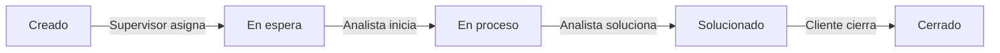
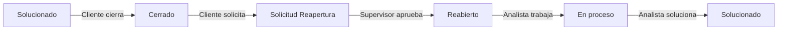
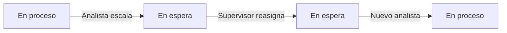

# 📋 Flujo Completo de Tickets - Fuente de Verdad

## 🎯 Estados Oficiales del Ticket

**SOLO existen 6 estados:**

1. **Creado** - Cliente registra el ticket
2. **En espera** - Pendiente de asignación a analista
3. **En proceso** - Analista trabajando en la solución
4. **Solucionado** - Cliente recibe propuesta de solución
5. **Cerrado** - Cliente acepta y evalúa
6. **Reabierto** - Cliente reactiva ticket

---

## 👥 Roles y Permisos

### Cliente
- ✅ Crear tickets
- ✅ Cerrar tickets (solo si están en "solucionado")
- ✅ Solicitar reapertura (solo si están en "cerrado")
- ✅ Evaluar tickets cerrados
- ❌ NO puede asignar analistas
- ❌ NO puede cambiar prioridad

### Analista
- ✅ Iniciar trabajo (en_espera → en_proceso)
- ✅ Solucionar ticket (en_proceso → solucionado)
- ✅ Escalar ticket (en_proceso → en_espera + comentario)
- ❌ NO puede cerrar tickets
- ❌ NO puede asignar/reasignar

### Supervisor
- ✅ Asignar analista (creado/en_espera → en_espera con analista)
- ✅ Reasignar analista (cuando está escalado)
- ✅ Aprobar reapertura (cerrado → reabierto)
- ✅ Confirmar cierre (solo después de que cliente cierre)
- ❌ NO puede cerrar sin acción previa del cliente
- ❌ NO puede reabrir sin solicitud del cliente

### Administrador
- ✅ Todas las acciones de supervisor
- ✅ Eliminar tickets
- ✅ Cambiar cualquier estado (emergencias)

---

## 🔄 Flujos Principales

### Flujo 1: Ticket Exitoso (Camino Feliz)



**Paso a paso:**

1. **Cliente crea ticket**
   - Estado: `creado`
   - WebSocket: `ticket_created` → `global_tickets`
   - Visible para: Supervisor, Admin

2. **Supervisor asigna analista**
   - Estado: `creado` → `en_espera`
   - WebSocket: `ticket_asignado` → `global_tickets`
   - Visible para: Cliente, Analista asignado, Supervisor, Admin

3. **Analista inicia trabajo**
   - Estado: `en_espera` → `en_proceso`
   - WebSocket: `ticket_iniciado` → `global_tickets`
   - Visible para: Cliente, Analista, Supervisor, Admin

4. **Analista soluciona**
   - Estado: `en_proceso` → `solucionado`
   - WebSocket: `ticket_solucionado` → `global_tickets`
   - Visible para: Cliente (notificación especial), Analista, Supervisor, Admin

5. **Cliente cierra y evalúa**
   - Estado: `solucionado` → `cerrado`
   - WebSocket: `ticket_cerrado` → `global_tickets`
   - Calificación guardada
   - Visible para: Todos (histórico)

---

### Flujo 2: Ticket con Reapertura



**Paso a paso:**

1. **Cliente solicita reapertura**
   - Estado: `cerrado` (sin cambio)
   - Campo: `tiene_solicitud_reapertura_pendiente = true`
   - WebSocket: `solicitud_reapertura` → `global_tickets`
   - Comentario creado con motivo

2. **Supervisor aprueba reapertura**
   - Estado: `cerrado` → `reabierto`
   - Campo: `tiene_solicitud_reapertura_pendiente = false`
   - WebSocket: `ticket_reabierto` → `global_tickets`
   - Ticket vuelve a lista activa

3. **Continúa flujo normal**
   - Supervisor puede reasignar analista
   - Analista trabaja nuevamente
   - Proceso se repite

---

### Flujo 3: Ticket Escalado



**Paso a paso:**

1. **Analista escala ticket**
   - Estado: `en_proceso` → `en_espera`
   - Asignación: Se elimina analista actual
   - Comentario: "Ticket escalado al supervisor"
   - WebSocket: `ticket_actualizado` → `global_tickets`
   - Flag: `data.escalado = true`

2. **Detección de escalamiento**
   - NO por estado (no existe estado "escalado")
   - SÍ por: `estado === 'en_espera' + comentario de escalamiento + sin analista`
   - Función: `fueEscaladoPorAnalista(ticket)`

3. **Supervisor reasigna**
   - Botón "Reasignar" en color ROJO
   - Asigna nuevo analista
   - Estado: `en_espera` (sin cambio)
   - WebSocket: `ticket_reasignado` → `global_tickets`

4. **Nuevo analista continúa**
   - Inicia trabajo normalmente
   - Estado: `en_espera` → `en_proceso`

---

### Flujo 4: Eliminación de Tickets

#### Eliminación Individual

```
Supervisor/Admin elimina ticket
↓
Backend: DELETE /tickets/:id
↓
WebSocket: ticket_eliminado → global_tickets
↓
Frontend: Elimina ticket de lista (todos los roles)
```

#### Eliminación Masiva

```
Admin elimina todos
↓
Backend: DELETE /tickets/borrar-todos
↓
WebSocket: todos_tickets_eliminados → global_tickets
↓
Frontend: Limpia lista completa (todos los roles)
```

---

## 📡 Eventos WebSocket

### Eventos Emitidos a `global_tickets`

| Acción | Evento | Datos Incluidos |
|--------|--------|-----------------|
| Crear ticket | `ticket_created` | ticket completo |
| Actualizar ticket | `ticket_actualizado` | ticket completo |
| Asignar analista | `ticket_asignado` | ticket + analista_nombre |
| Reasignar analista | `ticket_reasignado` | ticket + analista_nombre |
| Eliminar asignación | `asignacion_eliminada` | ticket_id |
| Analista inicia | `ticket_iniciado` | ticket completo |
| Analista soluciona | `ticket_solucionado` | ticket completo |
| Cliente cierra | `ticket_cerrado` | ticket + calificacion |
| Cliente reabre | `ticket_reabierto` | ticket completo |
| Solicitud reapertura | `solicitud_reapertura` | ticket + motivo |
| Cliente evalúa | `ticket_evaluado` | ticket + calificacion |
| Eliminar ticket | `ticket_eliminado` | ticket_id + ticket_info |
| Eliminar todos | `todos_tickets_eliminados` | deleted_count |
| Nuevo comentario | `nuevo_comentario` | comentario + ticket_id |

---

## 🔐 Reglas de Visibilidad

### Cliente
```javascript
puedeVer = ticket.id_cliente === user.id
```
- Solo ve sus propios tickets
- Todos los estados

### Analista
```javascript
puedeVer = ticket.asignacion_actual?.id_analista === user.id
```
- Solo ve tickets asignados a él
- Todos los estados excepto "creado" (antes de asignación)

### Supervisor/Admin
```javascript
puedeVer = true
```
- Ve TODOS los tickets
- Todos los estados

---

## 🎨 Reglas de UI

### Botones Cliente

| Estado | Botón Cerrar | Botón Reabrir |
|--------|--------------|---------------|
| creado | ❌ | ❌ |
| en_espera | ❌ | ❌ |
| en_proceso | ❌ | ❌ |
| solucionado | ✅ | ❌ |
| cerrado | ❌ | ✅ |
| reabierto | ❌ | ❌ |

### Botones Analista

| Estado | Botón Iniciar | Botón Solucionar | Botón Escalar |
|--------|---------------|------------------|---------------|
| creado | ❌ | ❌ | ❌ |
| en_espera | ✅ | ❌ | ❌ |
| en_proceso | ❌ | ✅ | ✅ |
| solucionado | ❌ | ❌ | ❌ |
| cerrado | ❌ | ❌ | ❌ |
| reabierto | ✅ | ❌ | ❌ |

### Botones Supervisor

| Condición | Botón Asignar | Botón Reasignar | Botón Cerrar | Botón Reabrir |
|-----------|---------------|-----------------|--------------|---------------|
| Sin analista + NO escalado | ✅ | ❌ | ❌ | ❌ |
| Escalado (comentario) | ❌ | ✅ (ROJO) | ❌ | ❌ |
| Solicitud reapertura | ❌ | ❌ | ✅ | ✅ |
| Cliente cerró | ❌ | ❌ | ✅ | ❌ |

---

## 🎯 Colores de Estado

```javascript
const estadoColors = {
  'creado': 'primary',      // Azul
  'en_espera': 'info',      // Celeste
  'en_proceso': 'warning',  // Amarillo
  'solucionado': 'success', // Verde
  'cerrado': 'secondary',   // Gris
  'reabierto': 'warning'    // Amarillo
};
```

### Semáforo (Supervisor)

```javascript
// Prioridad 1: Prioridad alta
if (prioridad === 'alta') return 'table-danger'; // Rojo

// Prioridad 2: Ticket escalado
if (fueEscaladoPorAnalista(ticket)) return 'table-warning'; // Amarillo

// Prioridad 3: Estado
if (estado === 'solucionado') return 'table-success'; // Verde
if (estado === 'en_proceso') return 'table-info'; // Azul
if (estado === 'cerrado') return 'table-secondary'; // Gris

return ''; // Sin color
```

---

## 🔄 Sincronización WebSocket

### Arquitectura

```
Backend emite evento
↓
global_tickets (room única)
↓
Todos los roles reciben
↓
Frontend filtra por rol
↓
UI se actualiza
```

### Funciones Helper Backend

```python
# TODAS emiten a global_tickets
emit_ws_event(socketio, event, data, rooms=[''])
emit_websocket_event(socketio, event, data, rooms)
emit_ticket_event(event, ticket, action, extra_data)
```

**IMPORTANTE:** El parámetro `rooms` se IGNORA, siempre emite a `global_tickets`

### Hook Frontend Centralizado

```javascript
// useWebSocketEvents.js
socket.on('ticket_updated', handleTicketUpdate);
socket.on('ticket_asignado', handleTicketUpdate);
socket.on('ticket_iniciado', handleTicketUpdate);
socket.on('ticket_solucionado', handleTicketUpdate);
socket.on('ticket_cerrado', handleTicketUpdate);
socket.on('ticket_reabierto', handleTicketUpdate);
socket.on('ticket_eliminado', handleTicketEliminado);
socket.on('todos_tickets_eliminados', handleTodosTicketsEliminados);
```

---

## ❌ Restricciones Importantes

### NO Permitido

1. ❌ Estado "escalado" - NO EXISTE
2. ❌ Cliente asigna analistas
3. ❌ Analista cierra tickets
4. ❌ Supervisor cierra sin acción del cliente
5. ❌ Supervisor reabre sin solicitud del cliente
6. ❌ Cambiar estado directamente sin flujo

### SÍ Permitido

1. ✅ Escalamiento por comentarios
2. ✅ Múltiples reaperturas
3. ✅ Reasignación de analistas
4. ✅ Admin puede forzar cualquier estado (emergencias)
5. ✅ Cliente puede cerrar inmediatamente después de "solucionado"

---

## 📊 Casos Especiales

### Caso 1: Ticket sin Analista

```
Estado: creado o en_espera
Analista: null
Acción: Supervisor debe asignar
```

### Caso 2: Ticket Escalado

```
Estado: en_espera
Analista: null (fue eliminado)
Comentario: "escalado"
Acción: Supervisor debe reasignar (botón rojo)
```

### Caso 3: Solicitud Reapertura Pendiente

```
Estado: cerrado
Campo: tiene_solicitud_reapertura_pendiente = true
Acción: Supervisor ve botones cerrar/reabrir
```

### Caso 4: Cliente Cierra Directamente

```
Estado: solucionado → cerrado
Acción: Supervisor puede confirmar cierre
```

---

## 🧪 Validaciones

### Backend

```python
# Validar transición de estado
def puede_cambiar_estado(ticket, nuevo_estado, user_role):
    if user_role == 'cliente':
        return nuevo_estado in ['cerrado'] and ticket.estado == 'solucionado'
    elif user_role == 'analista':
        return nuevo_estado in ['en_proceso', 'solucionado', 'en_espera']
    elif user_role == 'supervisor':
        return nuevo_estado in ['reabierto'] and ticket.tiene_solicitud_reapertura_pendiente
    elif user_role == 'administrador':
        return True
    return False
```

### Frontend

```javascript
// Validar acción disponible
const puedeRealizarAccion = (ticket, accion, userRole) => {
  switch (accion) {
    case 'cerrar':
      return userRole === 'cliente' && ticket.estado === 'solucionado';
    case 'reabrir':
      return userRole === 'cliente' && ticket.estado === 'cerrado';
    case 'iniciar':
      return userRole === 'analista' && ticket.estado === 'en_espera';
    case 'solucionar':
      return userRole === 'analista' && ticket.estado === 'en_proceso';
    case 'aprobar_reapertura':
      return userRole === 'supervisor' && ticket.tiene_solicitud_reapertura_pendiente;
    default:
      return false;
  }
};
```

---

## 📝 Notas Finales

1. **Este documento es la ÚNICA fuente de verdad** para el flujo de tickets
2. Cualquier discrepancia con el código debe resolverse siguiendo este documento
3. Los 6 estados son INMUTABLES - no agregar más estados
4. WebSocket SIEMPRE usa `global_tickets` - sin excepciones
5. Escalamiento se detecta por COMENTARIOS, no por estado
6. Supervisor actúa DESPUÉS del cliente, nunca antes

---

*Documento creado: 26/12/2025*  
*Versión: 1.0 - Fuente de Verdad Definitiva*  
*Última actualización: 26/12/2025*
