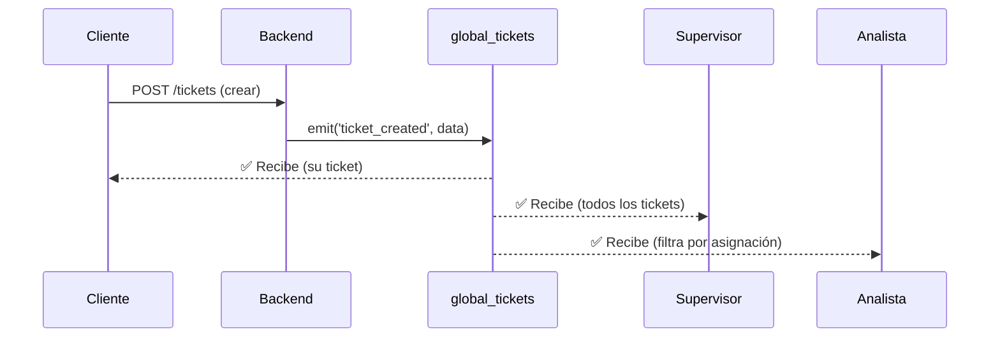

# 🌐 Arquitectura Global Sockets - TiBACK

## Filosofía: Una Room para Todos

```
┌─────────────────────────────────────────────────────────────┐
│                    🎯 global_tickets                        │
│                                                             │
│   ┌─────────┐   ┌─────────┐   ┌─────────┐   ┌─────────┐   │
│   │ Cliente │   │ Analista│   │  Super  │   │  Admin  │   │
│   └────┬────┘   └────┬────┘   └────┬────┘   └────┬────┘   │
│        │             │             │             │         │
│        └─────────────┴──────┬──────┴─────────────┘         │
│                             │                               │
│                    TODOS RECIBEN TODO                       │
│                    El frontend filtra                       │
└─────────────────────────────────────────────────────────────┘
```

---

## Principio Central

> **Una única room `global_tickets` → Todos reciben todos los eventos → Frontend filtra con `useMemo`**

### Backend: Emisión Simplificada
```python
# utils_routes.py
def emit_to_global(event_name, data):
    socketio.emit(event_name, data, room='global_tickets')
```

### Frontend: Conexión Única
```javascript
// store.js
joinRoom: (socket, role, userId) => {
    socket.emit("join_room", "global_tickets");
}
```

### Frontend: Filtrado por Rol
```javascript
// En hook del cliente - filtra solo sus tickets
const misTickets = useMemo(() => 
    tickets.filter(t => t.id_cliente === userId),
    [tickets, userId]
);
```

---

## Flujo de Datos



---

## Archivos Clave

| Archivo | Función |
|---------|---------|
| `src/api/utils/websocket_utils.py` | `emit_ticket_event()` - Emite a global_tickets |
| `src/api/routes/utils_routes.py` | `emit_to_global()` - Helper centralizado |
| `src/front/store.js` | `joinRoom()` - Une a global_tickets |
| `src/front/hooks/useWebSocketEvents.js` | Hook común para todos los roles |

---

## Eventos Emitidos

| Evento | Cuándo | Datos Clave |
|--------|--------|-------------|
| `ticket_created` | Cliente crea ticket | `ticket`, `id_cliente` |
| `ticket_asignado` | Supervisor asigna | `ticket`, `analista_id` |
| `ticket_solucionado` | Analista resuelve | `ticket`, `estado` |
| `ticket_cerrado` | Cliente/Supervisor cierra | `ticket_id`, `calificacion` |
| `ticket_evaluado` | Cliente califica | `ticket_id`, `calificacion` |
| `ticket_escalado` | Analista escala | `ticket`, `action` |

---

## 📊 Comparativa de Soluciones WebSocket

| Criterio | Global Tickets (Actual) | Rooms por Rol | Rooms por Ticket | Pub/Sub Redis |
|----------|------------------------|---------------|------------------|---------------|
| **Simplicidad de Código** | 10 | 6 | 4 | 5 |
| **Mantenibilidad** | 9 | 5 | 4 | 6 |
| **Tiempo Real** | 10 | 10 | 10 | 10 |
| **Escalabilidad (usuarios)** | 6 | 8 | 9 | 10 |
| **Escalabilidad (servidores)** | 5 | 5 | 5 | 10 |
| **Uso de Memoria** | 6 | 7 | 5 | 8 |
| **Facilidad de Debugging** | 10 | 6 | 4 | 5 |
| **Consistencia de Datos** | 10 | 7 | 6 | 9 |
| **Tiempo de Implementación** | 10 | 7 | 5 | 3 |
| **Adecuado para MVP/Startup** | 10 | 7 | 5 | 4 |
| **TOTAL** | **86/100** | **68/100** | **57/100** | **70/100** |

---

## Descripción de Cada Enfoque

### 1️⃣ Global Tickets (Actual) - ⭐ 86/100

**Cómo funciona:**
- Una única room `global_tickets`
- Todos los usuarios conectados reciben todos los eventos
- El frontend filtra lo que necesita mostrar

**Ventajas:**
- ✅ Código extremadamente simple
- ✅ Cero inconsistencias entre rooms
- ✅ Fácil de debugear (un solo punto de emisión)
- ✅ Perfecto para equipos pequeños/medianos

**Desventajas:**
- ❌ Transferencia de datos innecesarios al cliente
- ❌ No escala bien con +10,000 usuarios concurrentes

**Ideal para:** Startups, MVPs, equipos < 500 usuarios concurrentes

---

### 2️⃣ Rooms por Rol - 68/100

**Cómo funciona:**
```python
socketio.emit('evento', data, room='supervisores')
socketio.emit('evento', data, room='analistas')
socketio.emit('evento', data, room='clientes')
```

**Ventajas:**
- ✅ Solo envía a roles relevantes
- ✅ Menos datos transferidos

**Desventajas:**
- ❌ Código duplicado para emitir a múltiples rooms
- ❌ Fácil crear inconsistencias (olvidar emitir a un rol)
- ❌ Más difícil de mantener

---

### 3️⃣ Rooms por Ticket - 57/100

**Cómo funciona:**
```python
socketio.emit('evento', data, room=f'ticket_{ticket_id}')
```

**Ventajas:**
- ✅ Granularidad máxima
- ✅ Solo reciben usuarios interesados en ese ticket

**Desventajas:**
- ❌ Gestión compleja de join/leave rooms
- ❌ Usuario debe unirse a cada ticket que le interesa
- ❌ Lógica de limpieza de rooms

---

### 4️⃣ Pub/Sub con Redis - 70/100

**Cómo funciona:**
```python
redis.publish('tickets', json.dumps(evento))
# Workers suscritos procesan y emiten a clientes
```

**Ventajas:**
- ✅ Escala horizontalmente (múltiples servidores)
- ✅ Persistencia de mensajes
- ✅ Desacoplamiento

**Desventajas:**
- ❌ Infraestructura adicional (Redis)
- ❌ Complejidad de implementación
- ❌ Overhead para aplicaciones pequeñas

---

## ¿Cuándo Cambiar de Enfoque?

| Si tienes... | Usa |
|--------------|-----|
| < 500 usuarios concurrentes | Global Tickets ✅ |
| 500 - 5,000 usuarios | Rooms por Rol |
| 5,000 - 50,000 usuarios | Rooms por Ticket + Redis |
| > 50,000 usuarios | Pub/Sub con Redis + Sharding |

---

## Conclusión

Para TiBACK con sistema de tickets con roles definidos (Cliente, Analista, Supervisor, Admin), **Global Tickets es la solución óptima** porque:

1. **Simplicidad > Complejidad prematura**
2. **El filtrado en frontend es instantáneo** (useMemo con arrays pequeños)
3. **Cero bugs de sincronización** entre rooms
4. **Fácil de debugear** - todos los eventos en un solo lugar
5. **Si necesitas escalar**, migrar a rooms por rol toma ~2 horas
